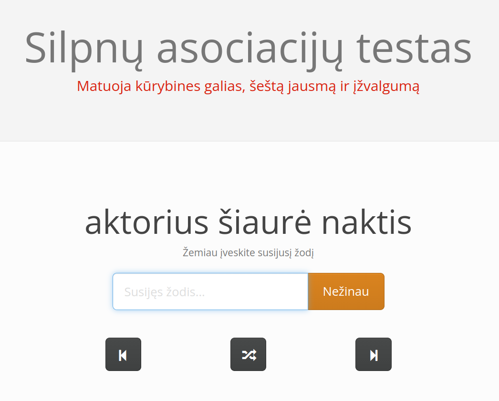

# Lithuanian Remote Associates Test



Previously available at [http://silpnasrysys.lt](http://silpnasrysys.lt)

## About

Wikipedia: [Remote Associates Test](http://silpnasrysys.lt/)

## Running 

Option 1:

```commandline
$ cp dotlein-env .lein-env
$ lein do clean, cljsbuild [once or auto]
$ lein repl
=> (use 'rat.core)
=> (run "localhost" 3000)
```

Option 2:

```commandline
$ lein do clean, cljsbuild once, uberjar
$ java -jar target/uberjar/rat-0.1.0-standalone.jar
```

Go to: http://localhost:3000

## Deployment

    $ lein do clean, cljsbuild once, uberjar
    $ mkdir -p /opt/rat
    $ cp target/uberjar/rat-0.1.0-standalone.jar /opt/rat
    $ cp resources/associations.txt /opt/rat

Configure Ubuntu Upstart with config/etc/init/rat.conf

    $ sudo service rat start
    
Configure Web Server to proxy requests to localhost:3000
